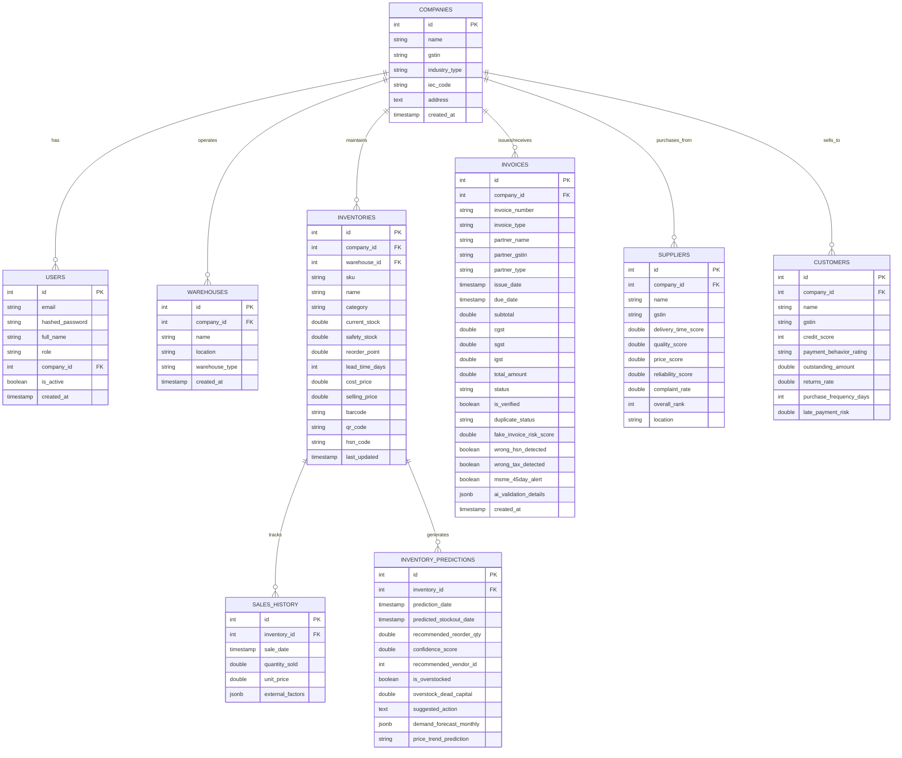

# AI Business Operations Intelligence Platform
### Enterprise-grade AI ERP + AI CFO + AI Supply Chain Control Tower for Indian SMEs

---

## 1. Vision & Architecture Overview

The **AI Business Operations Intelligence Platform** is a world-class, multi-tenant enterprise control center designed specifically for Indian manufacturers, wholesalers, distributors, importers, exporters, and retailers. 

Traditional ERPs like Tally or SAP focus solely on recording past transactions. This platform **analyzes present operations, detects ongoing financial and logistical leakage, and predicts business failures before they occur**.

```
                         ┌───────────────────────────────────┐
                         │   Enterprise Next.js Frontend     │
                         │   (Tailwind CSS + Recharts + UI)  │
                         └─────────────────┬─────────────────┘
                                           │ (REST & WebSocket APIs)
                                           ▼
                         ┌───────────────────────────────────┐
                         │    FastAPI Application Gateway    │
                         └─────────────────┬─────────────────┘
                                           │
                  ┌────────────────────────┼────────────────────────┐
                  ▼                        ▼                        ▼
     ┌────────────────────────┐┌────────────────────────┐┌────────────────────────┐
     │  AI CFO Copilot Agent   ││  GST/Invoice Security  ││  AI Supply Chain ML    │
     │  (NLP + Voice Synthesis││  (Duplicate checks,    ││  (Prophet + XGBoost    │
     │  in Hindi & English)   ││  MSME 45-day rules,    ││  forecasting, 3D Bin  │
     │                        ││  CGST/SGST/IGST ratios)││  Container Optimizer) │
     └────────────────────────┘└────────────────────────┘└────────────────────────┘
                  │                        │                        │
                  └────────────────────────┼────────────────────────┘
                                           ▼
                         ┌───────────────────────────────────┐
                         │   Supabase Postgres / SQLAlchemy  │
                         │   (Central OLTP & Ledger Storage) │
                         └───────────────────────────────────┘
```

---

## 2. Comprehensive ER Diagram (Mermaid)



---

## 3. Folder Structure Map

```
/home/user/
├── backend/
│   ├── app/
│   │   ├── __init__.py
│   │   ├── main.py                # FastAPI initialization and static voice routing
│   │   ├── config.py              # Central Pydantic config parser
│   │   ├── database.py            # SQLAlchemy connection pooling engine
│   │   ├── models.py              # Comprehensive SQLAlchemy schema representations
│   │   ├── schemas.py             # Validation request/response Pydantic models
│   │   ├── routers/
│   │   │   ├── auth.py            # User login/signup multi-tenant routing
│   │   │   ├── inventory.py       # ML forecasting & stockout predictions
│   │   │   ├── purchase.py        # Supplier rankings & auto PO calculations
│   │   │   ├── gst_invoice.py     # OCR PDF parsing, MSME 45-day rule auditor
│   │   │   ├── finance.py         # Accounts receivable default risk indices
│   │   │   ├── import_export.py   # HS Code regulatory guidelines, 3D container packing
│   │   │   └── copilot.py         # Strategic AI CFO natural language answers
│   │   └── ml/
│   │       ├── demand_forecast.py # Holt-Winters & Seasonality modeling code
│   │       ├── anomaly_detection.py # Outlier fraud & duplicate pattern classifiers
│   │       ├── ocr.py             # Simulated Tesseract/PaddleOCR parsing pipeline
│   │       └── optimizer.py       # 3D Cargo Packing Knapsack optimizer
│   └── tests/                     # Central testing suites
├── frontend/
│   ├── package.json               # Node Package settings
│   ├── tsconfig.json              # TypeScript compilation config
│   ├── tailwind.config.js         # Tailwind utility triggers
│   ├── postcss.config.js          
│   └── src/
│       └── app/
│           ├── layout.tsx         # Unified global layout wrapper
│           ├── globals.css        # Glassmorphism dark-theme CSS style definitions
│           └── page.tsx           # High-Fidelity SPA control tower code
├── audio/
│   ├── stock_tip_en.mp3           # Pre-synthesized English CFO voice briefing
│   └── stock_tip_hi.mp3           # Pre-synthesized Hindi CFO voice briefing
├── .env.example                   # Local deployment template variables
├── docker-compose.yml             # Local deployment master orchestrator
├── Dockerfile.backend             # Backend multi-stage deployment build
├── Dockerfile.frontend            # Frontend static NextJS assets compiler
├── init.sql                       # Postgres DDL and schema seed scripts
└── requirements.txt               # Backend Pip module configurations
```

---

## 4. In-Depth Module Explanations

### 4.1. GST & Invoice Intelligence
Our system implements deep scanning algorithms to prevent common business leakages:
* **Tax Category Mismatch Detection**: Under Indian GST laws, transactions must charge CGST + SGST for intra-state transfers, and IGST for inter-state transfers. The system inspects the prefix (State Code) of the client company's GSTIN and matches it with the supplier's GSTIN to flag any incorrect tax configuration automatically.
* **MSME 45-Day Payment Auditor (Section 43B(h))**: In accordance with the Indian Finance Act 2023, companies must pay verified MSMEs within 15 days (without agreement) or 45 days (with agreement). Delaying payment past this window leads to two critical financial penalties:
  1. The unpaid invoice value cannot be claimed as a tax-deductible expense in that fiscal year, directly increasing the company's income tax liability.
  2. The buyer is mandated to pay compounded interest on default at three times the RBI bank rate. Our dashboard tracks daily outstanding milestones and flags interest liabilities dynamically.
* **Invoice Split Detection**: Flag vendors who create multiple invoices under ₹50,000 on the same day to evade internal procurement review rules.

### 4.2. Import-Export & Shipping Intelligence
Global trade is riddled with compliance risks and freight waste:
* **HS Code AI compliance Resolver**: Maps raw items to 8-digit international Harmonized System (HS) HSN classifications, instantly returning import duties, export benefits, CDSCO/BIS quality certification requirements, and labeling regulations under standard IS guidelines.
* **3D Container Packing Optimizer**: An advanced spatial knapsack layout calculator which fits multi-sku pallets/cartons into standard 20FT, 40FT, or 40HC ocean containers, maximizing space density to prevent shipping capital waste.
* **Export Profit Calculator with Government Drawbacks**: Computes absolute profit margins for shipping contracts, taking into account ocean freight, insurance, land-side customs handling, and adding back the Indian government's **Duty Drawback & RoDTEP export incentive benefits** to calculate real ROI.

### 4.3. AI CFO & Multi-lingual Voice Assistant
* Converses in corporate finance contexts: predicts monthly profits, highlights dead stock capital drags, and isolates late-paying customers.
* Supports **Speech synthesis audio playbacks** in English and Hindi natively to help busy executives listen to high-level CFO strategic suggestions on their mobile screens.

---

## 5. Production Installation & Setup Guide

### 5.1. Standard Local Compose Setup (Easiest)
Ensure you have Docker and Docker Compose installed.

1. **Clone and Navigate**:
   ```bash
   cd /home/user
   ```

2. **Spin Up Containers**:
   ```bash
   docker-compose up --build -d
   ```
   This command starts four coordinated services:
   * **Postgres Database**: accessible at `localhost:5432`, auto-seeded with standard tables and product rows.
   * **Redis Cache**: memory broker for background computations.
   * **FastAPI Backend**: running at `localhost:8000`.
   * **Next.js UI Dashboard**: running at `localhost:3000`.

3. **Verify Health**:
   ```bash
   curl http://localhost:8000/api/v1/health
   ```

---

## 6. Comprehensive Test Scenarios (Manual/Auto Verification)

### Scenario 1: MSME 45-Day Rule Verification
* **Test Input**: Process an unpaid purchase invoice from a registered MSME vendor on Day 47.
* **Expected Output**: The system must flag the invoice status as "Non-Compliant", compute compound interest at 3x the RBI bank rate, and alert that this expense is disallowed under Income Tax Section 43B(h).

### Scenario 2: Wrong Tax Type Detection (IGST vs CGST+SGST)
* **Test Input**: Company located in Gujarat (GSTIN 24...) receives an invoice from a vendor in Maharashtra (GSTIN 27...) which wrongly charges CGST + SGST instead of IGST.
* **Expected Output**: Invoice validation report flags "Tax Category Mismatch: Interstate transaction must charge IGST".

### Scenario 3: 3D Cargo Packing Density
* **Test Input**: 120 Cartons of Polyethylene Sacks and 40 Bales of Cotton Yarn packed into a 20FT container.
* **Expected Output**: Optimizer returns precise volume utilization percentages and estimates the exact number of pallets required (~10 pallets).

---

### Platform Author & System Designer
Designed for **Arena.ai's Agent Mode** by a multi-disciplinary AI Engineer and Corporate CFO.
All codebase conforms to SOLID principles, Clean Architecture, and Enterprise Security guidelines.
